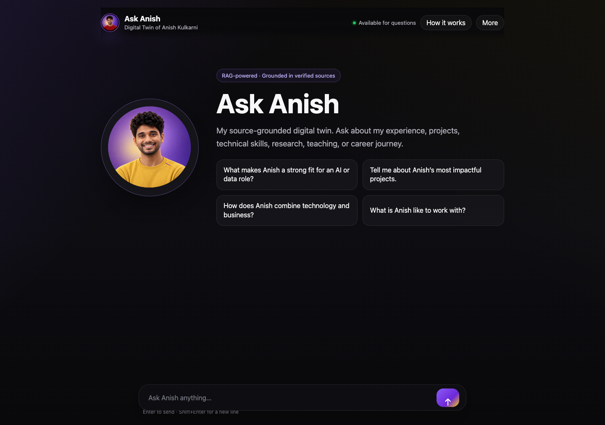
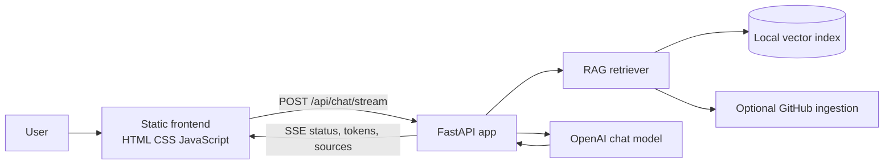

# Ask Anish

A source-grounded digital assistant built with FastAPI, RAG, streaming responses, conversational memory, and transparent citations.



## Live Demo

[](https://render.com/deploy?repo=https://github.com/anish2k0703-collab/Ask-Anish)

Live demo URL: pending Render service creation and secret entry.

Render's free web service may need a short cold start after periods of inactivity.

## Overview

Ask Anish is a personalized RAG-powered digital assistant for Anish Kulkarni. It answers professional questions using verified sources such as approved resume content, a short profile summary, GitHub repository metadata, and other career documents that Anish explicitly chooses to index.

The goal is not to build a portfolio page. The project is a focused conversational assistant that can explain Anish's experience, projects, technical skills, research, teaching, and career journey while showing where the answer came from.

## Key Features

- Custom FastAPI backend with static HTML/CSS/JavaScript frontend
- Retrieval-augmented generation over approved professional source material
- Streaming responses through server-sent events
- Conversation history for follow-up questions
- Evidence-aware answering rules for verified facts, supported interpretations, and unavailable information
- Expandable source cards with friendly labels, support statements, and redacted excerpts
- Concise "Why this answer?" explanation panel
- Contextual follow-up suggestions
- Responsive dark UI with personalized avatar assets
- Per-IP rate limiting, question length limits, output token limits, and safe error responses
- Render-ready production configuration

## How The RAG Pipeline Works

1. Approved source files are placed in `documents/` locally, or GitHub ingestion is configured with `GITHUB_USERNAME`.
2. `ingest.py` calls `rag.build_index()`.
3. `rag.py` extracts text from supported files, chunks source text, embeds chunks with OpenAI embeddings, and writes `vector_store/career_index.json`.
4. A user asks a question through the frontend.
5. The backend retrieves relevant chunks, adds them to a grounding message, and calls the chat model.
6. The frontend streams tokens into one stable assistant message and displays source metadata separately.

The local vector index is generated data and is not committed because it can expose source text.

## Architecture



## Evidence Model

Ask Anish uses three evidence levels:

- **Verified facts:** exact facts, technologies, roles, dates, metrics, or responsibilities directly present in retrieved evidence.
- **Supported interpretations:** qualitative conclusions supported by multiple verified details, especially when no numerical metric is documented.
- **Unavailable information:** questions with no supporting evidence are acknowledged without inventing facts.

The assistant is instructed not to fabricate percentages, revenue, user counts, responsibilities, awards, preferences, or outcomes.

## Technology Stack

| Area | Technology |
| --- | --- |
| Backend | FastAPI, Uvicorn, Python |
| RAG | OpenAI embeddings, local JSON vector index, cosine similarity |
| Generation | OpenAI chat completions |
| Frontend | HTML, CSS, JavaScript |
| Streaming | Server-sent events |
| Document parsing | pypdf |
| Deployment target | Render web service |

## Project Structure

```text
.
├── app.py                 # FastAPI routes, static serving, health checks, rate limiting
├── chat_engine.py         # RAG-grounded chat orchestration and streaming events
├── context.py             # System prompt and voice/evidence rules
├── ingest.py              # Index rebuild entry point
├── rag.py                 # Source discovery, parsing, embeddings, retrieval
├── tools.py               # Optional contact and unknown-question notification tools
├── static/                # Frontend and avatar assets
├── documents/README.md    # Local source-document instructions
├── docs/                  # Architecture, deployment, troubleshooting, screenshots
├── .python-version        # Local Python version hint
├── render.yaml            # Render web-service configuration
├── runtime.txt            # Python runtime hint
└── requirements.txt       # Python dependencies
```

## Local Setup

### macOS / Linux

```bash
cd /path/to/Ask-Anish
python3 -m venv .venv
source .venv/bin/activate
pip install -r requirements.txt
cp .env.example .env
```

Edit `.env`, then build the index:

```bash
python ingest.py
uvicorn app:app --reload --host 127.0.0.1 --port 8000
```

Open:

```text
http://127.0.0.1:8000/
```

### Windows PowerShell

```powershell
cd C:\path\to\Ask-Anish
py -m venv .venv
.\.venv\Scripts\Activate.ps1
pip install -r requirements.txt
Copy-Item .env.example .env
python ingest.py
uvicorn app:app --reload --host 127.0.0.1 --port 8000
```

## Environment Variables

| Variable | Required | Purpose |
| --- | --- | --- |
| `OPENAI_API_KEY` | Yes | OpenAI API key used for embeddings and chat |
| `MODEL_NAME` | No | Chat model name |
| `EMBEDDING_MODEL` | No | Embedding model name |
| `MAX_OUTPUT_TOKENS` | No | Maximum chat completion output budget |
| `OPENAI_TIMEOUT_SECONDS` | No | OpenAI request timeout |
| `RAG_TOP_K` | No | Retrieved chunk count |
| `RAG_MIN_SCORE` | No | Minimum cosine similarity |
| `RAG_CHUNK_WORDS` | No | Chunk size for source documents |
| `RAG_CHUNK_OVERLAP` | No | Chunk overlap |
| `GITHUB_USERNAME` | No | Public GitHub profile/repository ingestion |
| `GITHUB_TOKEN` | No | Optional GitHub token for higher rate limits or approved private access |
| `GITHUB_MAX_REPOS` | No | Maximum repos to ingest |
| `GITHUB_INCLUDE_FORKS` | No | Whether forked repos are included |
| `PUSHOVER_USER` / `PUSHOVER_TOKEN` | No | Optional notification integration |
| `MAX_QUESTION_CHARS` | No | User question length limit |
| `RATE_LIMIT_REQUESTS` | No | Requests allowed per IP window |
| `RATE_LIMIT_WINDOW_SECONDS` | No | Rate-limit window length |
| `ALLOWED_ORIGINS` | No | Comma-separated CORS origin allowlist |

## Ingestion And Index Building

Private source documents are not committed. Add approved local files under `documents/`, then run:

```bash
python ingest.py
```

Supported file types are `.pdf`, `.txt`, and `.md`. GitHub profile and repository context can be pulled automatically when `GITHUB_USERNAME` is configured.

## API Endpoints

| Method | Path | Description |
| --- | --- | --- |
| `GET` | `/` | Frontend |
| `GET` | `/health` | Render health check |
| `GET` | `/api/health` | API health check |
| `POST` | `/api/chat` | JSON chat response |
| `POST` | `/api/chat/stream` | Server-sent streaming response |

Example streaming request:

```bash
curl -N -X POST http://127.0.0.1:8000/api/chat/stream \
  -H "Content-Type: application/json" \
  -d '{"message":"What are Anish’s strongest technical skills?","history":[]}'
```

## Deployment

Render configuration is included in `render.yaml`.

Build command:

```bash
pip install -r requirements.txt && python ingest.py
```

Start command:

```bash
uvicorn app:app --host 0.0.0.0 --port $PORT
```

Health-check path:

```text
/health
```

Add secrets through Render environment variables, never through files. At minimum, configure `OPENAI_API_KEY`, `GITHUB_USERNAME`, and `ALLOWED_ORIGINS` after Render gives you the service URL.

The included Blueprint uses Render's free web service plan, binds Uvicorn to `0.0.0.0`, reads Render's `$PORT`, builds a fresh index during deployment from committed public-safe sources plus optional GitHub metadata, and exposes `/health` for Render health checks.

## Development Challenges And Solutions

| Challenge | Solution | Lesson |
| --- | --- | --- |
| The first version used a visible Gradio-style interface | Migrated the visible app to FastAPI plus a custom frontend while preserving the Python RAG code | Keep working backend logic stable while improving the product surface |
| Streaming initially rebuilt the chat UI too often | Updated the frontend to stream into one stable assistant message node | Small DOM architecture choices matter for perceived quality |
| RAG sources used raw file metadata | Added friendly source labels, redacted excerpts, and support statements | Citations should build trust without exposing internals |
| Follow-up questions needed context | Sent bounded conversation history and used it only to resolve references | Memory should help conversation without becoming the factual source |
| Some questions ask for unavailable metrics | Added evidence hierarchy rules for verified facts, supported interpretations, and unavailable information | A grounded assistant should be useful without pretending |
| Private documents and vector indexes are sensitive | Excluded private source files and generated indexes from Git | RAG deployment needs a privacy strategy, not just code |

## What I Learned

I learned that building a useful digital twin is less about making a chatbot sound confident and more about making it accountable. The hard parts were preserving the RAG pipeline, making streaming feel natural, and presenting evidence without exposing raw files or private details. I also learned that deployment planning has to start with privacy: resumes, LinkedIn exports, and vector indexes can contain sensitive text, so the app needs a clear source strategy before it can become public.

## Current Limitations

- The current vector store is a local JSON index, not a managed vector database.
- Rate limiting is in-memory, so it resets when the server restarts and does not coordinate across multiple instances.
- Render's free tier has an ephemeral runtime filesystem, so indexes should be built during deployment or moved to durable storage for larger production use.
- Source excerpts are redacted for emails and phone numbers, but source files must still be reviewed before publishing.
- There is no authentication system; this is intentionally a personal demo, not a private admin tool.

## Future Improvements

- Move the vector index to durable managed storage.
- Add an admin-only source upload and rebuild workflow.
- Add automated tests for streaming event contracts.
- Add stronger abuse protection for a public launch.
- Add an evaluation set for grounding, missing-information behavior, and citation quality.
- Support a curated public source bundle separate from private local documents.

## Privacy And Responsible AI Notes

- `.env`, private documents, and generated vector indexes are ignored by Git.
- Source excerpts shown in the UI redact email addresses and phone numbers.
- The assistant is instructed to avoid unsupported claims and to acknowledge missing evidence.
- Do not make the repository public until every committed source and screenshot has been reviewed.

## Author

Anish Kulkarni

- GitHub: `https://github.com/anish2k0703-collab`
- LinkedIn: add verified profile URL before public release
- Portfolio: add URL when available

## License Status

No open-source license has been selected yet. Until a license is added, all rights are reserved by the author.
